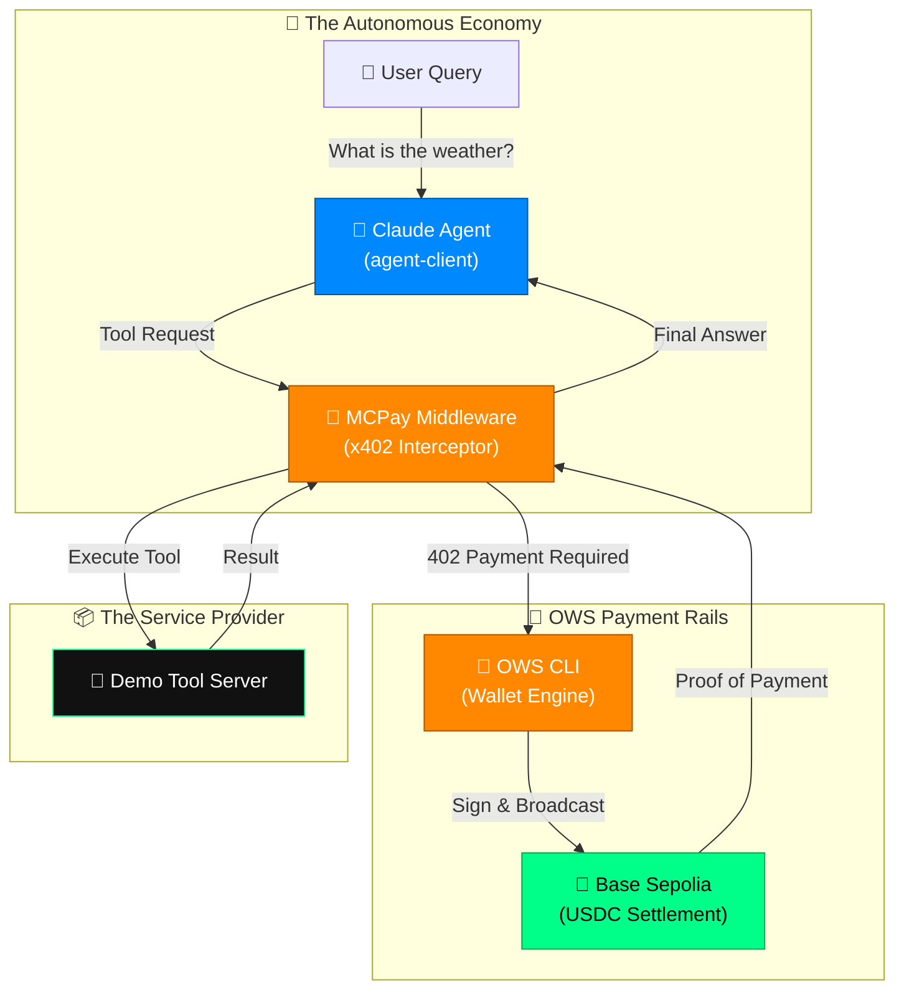

# ⚡ MCPay (The Monetization Layer for MCP Tools)

### 🏜️ Built for the **OWS Hackathon 2026** — *April 3rd, 2026*
**Track 03: Pay-Per-Call Services & API Monetization**

---

## 🚀 The Vision
Model Context Protocol (MCP) servers are the glue of the AI economy, but they lack a native monetization layer. **MCPay** solves this by wrapping any MCP tool behind **x402/MPP micropayments**. 

No API keys, no subscriptions, no accounts. Just an **OWS Wallet** and an autonomous agent economy.

## 🏗 Architecture & OWS Integration



---

## 🛠 Features
- **Plug-and-Play Middleware**: Wrap any existing Express/MJS tool server in one line of code (`app.use(mcpay(...))`).
- **Autonomous Agent (Claude 3.5)**: Powered by Claude and AI/ML API, our agent autonomously decides which tools to use, intercepts 402 "Payment Required" responses, and settles transactions using the **OWS CLI**.
- **Cross-Chain Micropayments**: Native x402 settlement on **Base Sepolia** using USDC.
- **OWS Policy Enforcement**: Agents pay based on spending policies (e.g., "$1 max per session"), ensuring they don't drain the wallet.
- **Real-time Registry Dashboard**: A glassmorphic Next.js dashboard to track tool calls, earnings, and agent interactions.

---

## 🏗 Project Structure
```text
MCPAY/
├── packages/
│   ├── mcpay-middleware/ # The core x402/OWS middleware (NodeJS Library)
│   ├── demo-tool-server/ # Monetized MCP tools (Weather Data, URL Summarizer)
│   ├── agent-client/     # Autonomous Claude Agent integrated with OWS CLI
│   └── registry-ui/      # Next.js Dashboard for real-time stats
├── setup.sh              # One-click OWS wallet & policy setup
└── .env                  # AI/ML API & Wallet configuration
```

---

## 🚦 Getting Started (The Demo Flow)

### 1. Prerequisites
- **OWS CLI Installed**: Ensure the Open Wallet Standard CLI is compiled and available.
- **WSL (Ubuntu)**: Required for OWS binary compatibility and policy execution.

### 2. Setup Wallets & Policies
Create the `mcpay-agent` (Buyer) and `tool-wallet` (Seller) in one command:
```bash
bash setup.sh
```
*Note: Make sure to fund your `mcpay-agent` wallet with Base Sepolia USDC!*

### 3. Launch the Machine Economy
In three separate terminals (via WSL):

**Terminal 1: Start the Monetized Tool Server**
```bash
cd packages/demo-tool-server
npm run start
```

**Terminal 2: Start the Dashboard**
```bash
cd packages/registry-ui
npm run dev
```

**Terminal 3: Fire the Agent**
```bash
# Ask the agent something that requires a paid tool!
npm run start --workspace=agent-client "What is the weather in Delhi and summarize https://ows.sh"
```

## 💸 Native Monetization (x402)
When the AI agent hits a monetized tool:
1. **Tool Server** returns `402 Payment Required` + x402 headers.
2. **Agent Intercepts** the response.
3. **OWS CLI** signs and broadcasts a USDC transaction on Base Sepolia.
4. **Tool Server** verifies settlement and returns the result.
5. **Dashboard** updates Volume & Call Count instantly.

---

## 🤝 Partners & Integration
- **Open Web Standard (OWS)**: Core payment rails, identity (WALLETS), and governance (POLICIES).
- **Base / Circle**: Micropayments settled securely on Base Sepolia in USDC.
- **AI/ML API**: High-intelligence model delivery (Claude 3.5 Sonnet).

---

## 🏜️ Made with passion for the Agentic Future. 
Built by [Nikhil Raikwar] for OWS Hackathon (Online). 🚀🏜️🏜️🏜️
