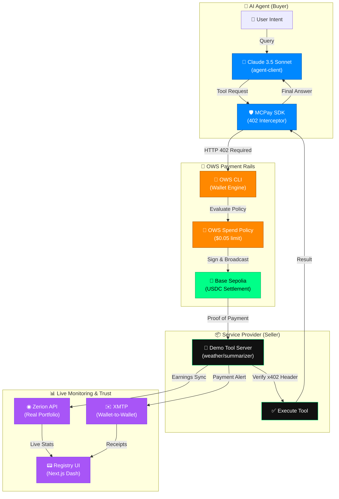

# ⚡ MCPay (The Monetization Layer for MCP Tools)

### Built for the **OWS Hackathon 2026** — *April 3rd, 2026*
**Track 03: Pay-Per-Call Services & API Monetization**
**Track 04: AI Agents & Automated Payments**
**Track 07: Data Oracles & Chain Tools**

---

## 🚀 The Vision
Model Context Protocol (MCP) servers are the glue of the AI economy, but they lack a native monetization layer. **MCPay** solves this by wrapping any MCP tool behind **x402/MPP micropayments**. 

No API keys, no subscriptions, no accounts. Just an **OWS Wallet**, an autonomous agent, and a verifiable payout loop.

## 🏗 Full-Stack Architecture



---

## 🛠 Features
- **Plug-and-Play Middleware**: Wrap any existing tool server in one line: `app.use(mcpay(...))`.
- **Autonomous Settlement**: Powered by Claude and AI/ML API, our agent intercepts 402 "Payment Required" and settles via **OWS CLI** without human help.
- **Zerion Balance Sync**: Dashboard shows actual on-chain USDC earnings via **Zerion API** instead of local database counters.
- **XMTP Notifications**: Instant wallet-to-wallet payment alerts using **XMTP JS SDK**. Tool owners get notified the second a payment hits the chain.
- **OWS Spend Governance**: Policies enforce per-session limits, prefix restrictions, and per-tool price caps.
- **Pixel-Perfect UI**: Glassmorphic Next.js 14 dashboard for real-time monitoring of the machine economy.

---

## 🚦 Getting Started

### 1. Prerequisites
- **OWS CLI Installed**: Required for wallet signing and policy enforcement.
- **Environment**: WSL (Ubuntu) for OWS binary compatibility.
- **API Keys**: Zerion, AI/ML API, and XMTP private keys in `.env`.

### 2. Launching the Economy

**Terminal 1: Start the Tool Server (Seller)**
```bash
cd packages/demo-tool-server
npm run start
```

**Terminal 2: Start the Dashboard (Monitoring)**
```bash
cd packages/registry-ui
npm run dev
```

**Terminal 3: Execute Agent (Buyer)**
```bash
# Agent will pay for weather data and URL summarization automatically
npm run start --workspace=agent-client "Check weather in Tokyo and summarize https://ows.sh"
```

---

## 🤝 Project Partners
- **Open Wallet Standard (OWS)**: The core infrastructure for identity, signing, and governance.
- **Base / Circle**: USDC settlement layer on Base Sepolia.
- **Zerion API**: Real-time on-chain portfolio tracking and visualization.
- **XMTP**: Native wallet-to-wallet communication protocol for receipts.
- **AI/ML API**: High-intelligence model inference (Claude 3.5 Sonnet).

---

Built with passion for the **OWS Hackathon 2026**. 🚀
Developed by **Nikhil Raikwar**.
No API keys. No subscriptions. Just a wallet.
