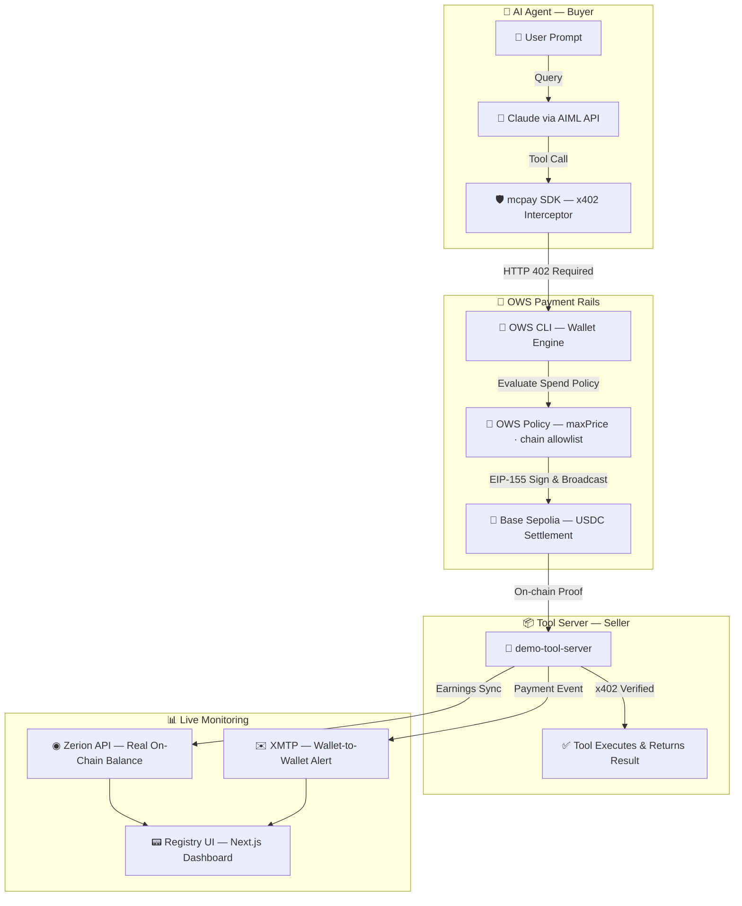

# MCPay — The Native Monetization Layer for MCP Tools

[](https://www.npmjs.com/package/@nikhilraikwar/mcpay)
[](https://opensource.org/licenses/MIT)
[](https://ows.sh)
[](https://sepolia.basescan.org)

**OWS Hackathon 2026** · The first npm middleware that wraps any MCP tool server behind **x402 micropayments**, settled autonomously by **OWS CLI** on **Base Sepolia**. No API keys, no subscriptions, no accounts — just an OWS wallet and an HTTP request.

---

## What is MCPay?

MCPay is a 3-line Express middleware that transforms any MCP tool endpoint into a monetized, pay-per-call service. Agents pay in **USDC on Base Sepolia** via the x402 protocol. The OWS CLI handles wallet signing and spend policy enforcement autonomously. Every payment triggers a **real-time XMTP wallet notification** and syncs earnings to a **live Zerion dashboard**.

```
Agent HTTP Request → MCPay 402 → OWS Signs USDC → On-Chain Verified → Tool Executes
```

---

## Architecture



---

## Packages

```
MCPAY/
├── packages/
│   ├── mcpay-middleware/     ← npm package (@nikhilraikwar/mcpay)
│   │   └── src/index.ts      x402 enforcement · stats · onPayment callback · mcpayFetch()
│   │
│   ├── demo-tool-server/     ← Express server with 3 live x402-gated tools
│   │   ├── server.ts         weather-data · url-summarizer · check-portfolio
│   │   ├── xmtp-notifier.ts  Real-time wallet-to-wallet XMTP payment alerts
│   │   └── zerion.ts         Live on-chain portfolio tracking via Zerion API
│   │
│   ├── agent-client/         ← Autonomous Claude agent
│   │   └── agent.ts          Plan → OWS Pay → Execute loop via AIML API
│   │
│   └── registry-ui/          ← Next.js 14 dashboard
│       └── app/
│           ├── page.tsx      Landing page with full documentation
│           └── dashboard/    AI Playground · Live Feed · XMTP Inbox · Zerion · Policy
```

---

## The mcpay SDK

```typescript
import { mcpay, mcpayFetch, getStats } from '@nikhilraikwar/mcpay'

// SERVER: Wrap any route with x402 payment enforcement
app.use(...mcpay({
  price: '$0.01',                          // Fixed price per call
  walletAddress: '0xYourWallet',           // Your OWS tool wallet
  toolName: 'weather-data',
  description: 'Real-time weather data',
  onPayment: async (stats) => {
    // Fires after every successful settlement
    // Used for XMTP alerts, DB updates, webhooks
    console.log(`Earned ${stats.totalEarned} USDC total`)
  }
}))

// Dynamic pricing per AI model — covers Track 04 simultaneously
app.use(...mcpay({
  price: (req) => MODEL_PRICES[req.body.model] ?? '$0.01',
  toolName: 'ai-inference',
}))

// CLIENT: Agent-side fetch with automatic 402 → OWS payment → retry
const result = await mcpayFetch('http://localhost:3001/tools/weather-data', {
  method: 'POST',
  body: JSON.stringify({ city: 'Delhi' }),
  owsWallet: 'mcpay-agent',  // OWS CLI wallet name
  maxPrice: '$0.05'           // OWS policy ceiling
})
// → { city: 'Delhi', temperature: '38°C', _mcpay: { paid: '$0.01' } }
```

---

## Live x402 Tools

| Tool | Endpoint | Price | Description |
|---|---|---|---|
| `weather-data` | `POST /tools/weather-data` | `$0.01` | Real-time weather via wttr.in |
| `url-summarizer` | `POST /tools/url-summarizer` | `$0.02` | Summarize any URL with Claude |
| `check-portfolio` | `POST /tools/check-portfolio` | `$0.05` | Live crypto portfolio via Zerion API |

---

## Dynamic Inference Pricing

MCPay wraps AIML API inference behind x402 with per-model pricing — the first pay-per-inference layer on OWS:

| Model | Provider | Base Price | Surge (10x) |
|---|---|---|---|
| claude-opus-4-6 | Anthropic via AIML API | $0.05 | $0.50 |
| gpt-4o | OpenAI via AIML API | $0.03 | $0.30 |
| claude-sonnet-4-6 | Anthropic via AIML API | $0.02 | $0.20 |
| gemini-2.0-flash | Google via AIML API | $0.005 | $0.05 |
| llama-3.3-70b | Meta via AIML API | $0.001 | $0.01 |

Surge pricing activates when queue depth > 10 concurrent requests. OWS spend policy enforces a maxPrice ceiling so agents never overpay.

---

## Integrations

### OWS + x402 (Core)
Agents use OWS CLI to intercept 402 challenges. OWS evaluates spend policies (maxPrice, chain allowlists) and signs USDC transfers on Base Sepolia autonomously. Every transaction is verifiable on Basescan.

### XMTP (Wallet-to-Wallet Notifications)
Every settlement triggers a wallet-native XMTP message via `@xmtp/node-sdk`. Tool owners get instant payment alerts; agents receive cryptographic receipts stored in their XMTP inbox.

### Zerion API (Real On-Chain P&L)
Dashboard shows real USDC earned — not simulated counters. Zerion API pulls live wallet balance, DeFi positions, and decoded transaction history. Every dollar is verifiable on-chain.

### AIML API (Multi-Model Intelligence)
The demo agent uses Claude via AIML API to reason across tool calls. MCPay handles dynamic inference pricing per model tier automatically. No hardcoded API keys required for agents.

---

## AI Playground

The registry dashboard features a ChatGPT-style **AI Playground** that demonstrates the full machine-to-machine payment loop:

1. **User asks** — "What's the weather in Delhi?"
2. **Agent plans** — "I need weather-data tool ($0.01)"
3. **OWS signs** — USDC transaction broadcast on Base Sepolia
4. **Tool responds** — Data returned only after on-chain verification
5. **XMTP receipt** — Payment alert delivered to tool owner's wallet

---

## Running Locally

```bash
# 1. Clone and install
git clone https://github.com/NikhilRaikwar/MCPay.git
cd MCPay && npm install

# 2. Configure environment
cp .env.example .env
# Fill in: ANTHROPIC_API_KEY, TOOL_WALLET_ADDRESS, ZERION_API_KEY, XMTP_PRIVATE_KEY

# 3. Setup OWS wallets
bash setup.sh

# 4. Start tool server (Terminal 1)
npm run dev --workspace=demo-tool-server

# 5. Start dashboard (Terminal 2)
npm run dev --workspace=registry-ui

# 6. Run agent (Terminal 3)
npm run start --workspace=agent-client "What's the weather in Delhi?"
```

Visit `http://localhost:3000` → AI Playground → type any query → watch the full OWS payment flow live.

---

## Demo Flow for Judges

1. Open `http://localhost:3000/dashboard` → AI Playground tab
2. Type: `"What's the weather in Delhi and summarize https://ows.sh"`
3. Watch agent think → OWS CLI signs USDC → payment settles on Base Sepolia
4. Open XMTP tab → payment receipt arrived from tool wallet
5. Open Zerion tab → real on-chain balance updated

---

Built with ⚡ by **Nikhil Raikwar** for OWS Hackathon 2026.  
No API keys. No subscriptions. Just a wallet.