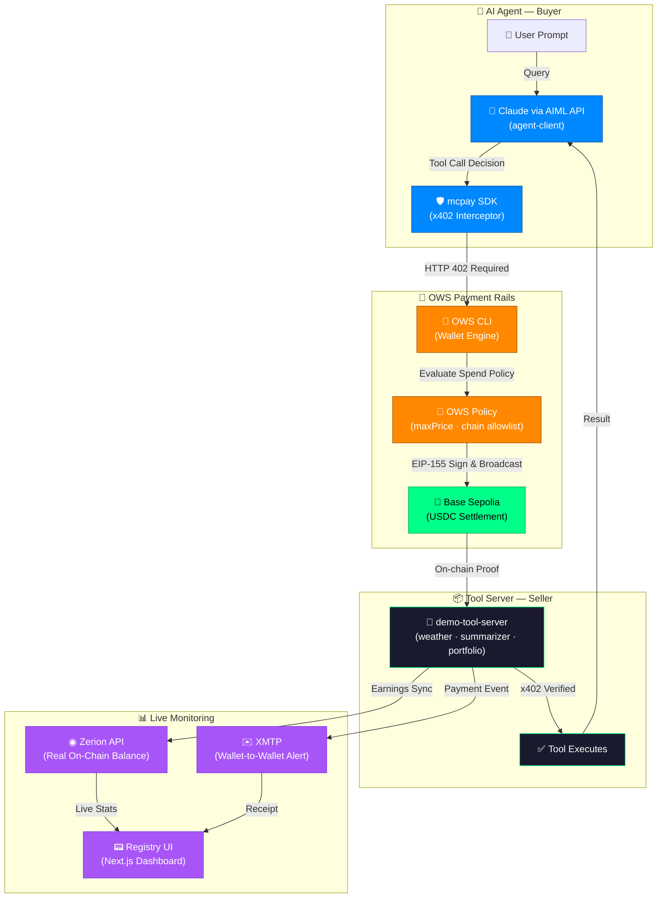

# MCPay — The Native Monetization Layer for MCP Tools

[](https://ows.sh)
[](https://ows.sh)
[](https://www.npmjs.com/package/@nikhilraikwar/mcpay)
[](https://opensource.org/licenses/MIT)

**OWS Hackathon 2026** · Building the economic layer for the Model Context Protocol.

MCPay is the first npm middleware that wraps any MCP tool server behind **x402 micropayments**, settled autonomously by **OWS CLI** on **Base Sepolia**. No API keys, no subscriptions, no accounts — just an OWS wallet and an HTTP request.

---

## Architecture



---

## Packages

```
MCPAY/
├── packages/
│   ├── mcpay-middleware/     ← The npm package (@nikhilraikwar/mcpay)
│   │   └── src/index.ts      x402 payment enforcement + stats + onPayment callback
│   │
│   ├── demo-tool-server/     ← Express server — 3 live x402-gated tools
│   │   ├── server.ts         Registers mcpay on all 3 tools, runs agent, streams logs
│   │   ├── xmtp-notifier.ts  Real-time XMTP wallet-to-wallet notifications
│   │   └── zerion.ts         Live portfolio tracking via Zerion API
│   │
│   ├── agent-client/         ← Autonomous AI agent
│   │   └── agent.ts          Plan → OWS Pay → Execute loop via AIML API
│   │
│   └── registry-ui/          ← Next.js 14 dashboard
│       └── app/
│           ├── page.tsx      Dashboard · AI Playground · Live Activity Feed
│           └── landing-page/ Full documentation & integration guide
```

---

## The mcpay SDK

Built on top of `@x402/express`. Wrap any Express route with full x402 payment enforcement in a single line:

```typescript
import { mcpay } from '@nikhilraikwar/mcpay'

// 1. Wrap your tool endpoint
app.use(...mcpay({
  price: '$0.01',
  walletAddress: '0x...',
  toolName: 'weather-data',
  description: 'Real-time weather data',
  onPayment: async (stats) => {
    // Optional: trigger XMTP alerts, update DB, etc.
  }
}))

// 2. Define your tool logic as usual
app.post('/tools/weather-data', (req, res) => {
  res.json({ temp: '24°C', city: req.body.city })
})
```

### Key Features
- **x402 Enforcement**: Automatically returns 402 Payment Required for unpaid requests.
- **Dynamic Pricing**: Support for price functions (e.g., higher price for complex queries).
- **On-Chain Receipts**: Every response includes a signed payment receipt with wallet/tx details.
- **Stats Engine**: Built-in tracking for `totalCalls`, `totalEarned`, and `lastCall`.

---

## Live x402 Tools

| Tool | Endpoint | Price | Settlement |
|---|---|---|---|
| `weather-data` | `POST /tools/weather-data` | `$0.01` | Base Sepolia USDC |
| `url-summarizer` | `POST /tools/url-summarizer` | `$0.02` | Base Sepolia USDC |
| `check-portfolio` | `POST /tools/check-portfolio` | `$0.05` | Base Sepolia USDC |

---

## Integrations

### OWS + x402 (Core)
Agents use **OWS CLI** to intercept 402 challenges. OWS evaluates spend policies (maxPrice budget, chain allowlists) and signs USDC transfers on **Base Sepolia** autonomously.

### XMTP (Notifications)
Every settlement triggers a wallet-to-wallet XMTP message via `@xmtp/node-sdk`. Tool owners get instant cash alerts; agents get cryptographic receipts in their XMTP inbox.

### Zerion API (Real P&L)
The dashboard uses **Zerion API** to pull live portfolio data. We show **real money** earned on-chain, verifiable via Basescan, rather than static database counters.

### AIML API (Intelligence)
Our demo agent uses **Claude 3.5 Sonnet** (via AIML API) to reason across tool calls. MCPay handles the **dynamic inference pricing** per model autonomously.

---

## AI Playground

The registry features a **ChatGPT-style AI Playground** that demonstrates the full "Machine-to-Machine" economy:
1. **User asks**: "What's the weather in Bina?"
2. **Agent Plans**: "I need the weather-data tool ($0.01)."
3. **OWS Signs**: Transaction hash generated on Base Sepolia.
4. **Tool Responds**: Data returned only after on-chain verification.

---

## Running Locally

1. **Clone & Install**: `npm install`
2. **Set Env**: Copy `.env.example` to `.env` (needs AIML API, Zerion, XMTP keys).
3. **Start Tool Server**: `npm run dev --workspace=demo-tool-server`
4. **Start Dashboard**: `npm run dev --workspace=registry-ui`
5. **Run Agent**: `npm run start --workspace=agent-client "Sagar weather"`

---

Built with ⚡ by **Nikhil Raikwar** for OWS Hackathon 2026.
No API keys. No subscriptions. Just a wallet.
