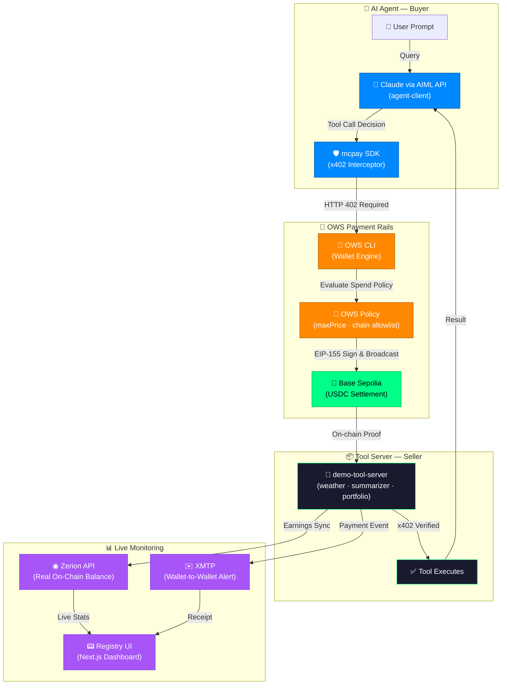

# MCPay — The Native Monetization Layer for MCP Tools

**OWS Hackathon 2026** · Track 03: Pay-Per-Call Services & API Monetization · Track 04: AI Agents & Automated Payments

The first npm middleware that wraps any MCP tool server behind **x402 micropayments**, settled autonomously by OWS CLI on Base Sepolia.

No API keys. No subscriptions. No accounts. Just an OWS wallet and an HTTP request.

---

## Architecture



---

## Packages

```
MCPAY/
├── packages/
│   ├── mcpay-middleware/     ← The npm package (mcpay)
│   │   └── src/index.ts      x402 payment enforcement + stats + onPayment callback
│   │
│   ├── demo-tool-server/     ← Express server — 3 live x402-gated tools
│   │   ├── server.ts         Registers mcpay on all 3 tools, runs agent, streams logs
│   │   ├── zerion.ts         Live USDC balance + transaction history via Zerion API
│   │   └── xmtp-notifier.ts  Sends wallet-to-wallet XMTP payment alert on each settlement
│   │
│   ├── agent-client/         ← Autonomous AI agent
│   │   └── agent.ts          Plan → OWS Pay → Execute → Respond loop via AIML API
│   │
│   └── registry-ui/          ← Next.js 14 dashboard
│       └── app/
│           ├── page.tsx      Dashboard · Tool Registry · AI Playground · OWS Interface
│           └── landing-page/ Public landing page with docs
```

---

## The mcpay Package

Built on top of `@x402/express` — wraps any Express route with full x402 payment enforcement in 3 lines:

```typescript
import { mcpay, getStats } from 'mcpay'

// Wrap any route — fixed price
app.use(...mcpay({
  price: '$0.01',
  walletAddress: process.env.TOOL_WALLET_ADDRESS,
  toolName: 'weather-data',
  description: 'Real-time weather for any city',
  onPayment: async (stats) => {
    await sendXMTPAlert(stats)   // wallet-to-wallet notification
  }
}))

// Dynamic pricing — per model, per load, per request
app.use(...mcpay({
  price: (req) => getDynamicPrice(req.body.model),  // claude-opus → $0.05, llama → $0.001
  walletAddress: process.env.TOOL_WALLET_ADDRESS,
  toolName: 'ai-inference',
  description: 'Pay-per-inference across 5 AI models',
}))

// Get live stats at any time
app.get('/stats', (req, res) => res.json(getStats()))
```

**What `mcpay()` returns:**
- `x402Middleware` — wraps the route, returns HTTP 402 with correct OWS wallet + amount headers
- `statsMiddleware` — intercepts successful responses, tracks `totalCalls` + `totalEarned`, appends `_mcpay` receipt to every response
- `onPayment` callback — triggered after each successful settlement (used for XMTP, DB, webhooks)

---

## Live x402 Tools

| Tool | Endpoint | Price | Status |
|---|---|---|---|
| `weather-data` | `POST /tools/weather-data` | `$0.01` | Live |
| `url-summarizer` | `POST /tools/url-summarizer` | `$0.02` | Live |
| `check-portfolio` | `POST /tools/check-portfolio` | `$0.05` | Live |

Every tool requires a verified on-chain USDC payment before executing. No payment = no response.

---

## Integrations

### OWS + x402
- Agent uses OWS CLI (`ows pay request`) to intercept every HTTP 402
- OWS evaluates spend policy: `maxPrice`, chain allowlist, vendor restrictions
- Signs USDC transfer on Base Sepolia with agent's private key via EIP-155
- x402 facilitator (`x402.org`) confirms the on-chain transfer before tool executes

### XMTP
- Built with `@xmtp/node-sdk`
- Every x402 settlement triggers a wallet-to-wallet XMTP message to the tool owner
- Tool owner receives: `"0xCc9A paid $0.01 for weather-data"`
- Agent gets a signed receipt in its own XMTP inbox

### Zerion API
- Dashboard shows **real** USDC balance — not a database counter
- Zerion fetches live wallet positions + transaction history from Base Sepolia
- P&L tracking proves actual revenue earned from tool calls

### AIML API
- Agent runs via AIML API (`anthropic/claude-opus-4-6` model)
- MCPay supports **dynamic price functions** per model:
  - `claude-opus-4-6` → `$0.05` · `gpt-4o` → `$0.03` · `llama-3.3-70b` → `$0.001`
- Surge pricing (1x–10x) based on queue depth
- OWS maxPrice ceiling — agent never overpays

---

## AI Playground

The dashboard includes a **ChatGPT-style AI Playground** that runs a real agent loop end-to-end:

```
Query: tell me weather of bhopal              ← top (always first)

[PLAN] Thinking via anthropic/claude-opus-4-6...
[PLAN] Suggested Tool: get_weather
[PAY]  Executing $0.01 OWS payment for weather-data
[EXEC] Data Received: {"city":"Bhopal","temperature":"26"...}

Agent Response:                               ← bottom (always last)
Here's the current weather for Bhopal...
```

Every step is a real operation — real Claude call, real OWS payment on Base Sepolia, real tool execution.

---

## Running Locally

### Prerequisites
- Node.js 18+
- OWS CLI installed (`ows wallet create mcpay-agent`)
- WSL / Linux for OWS binary

### Environment (`.env` in project root)
```env
ANTHROPIC_API_KEY=your_aiml_api_key
ANTHROPIC_BASE_URL=https://api.aimlapi.com/v1
ANTHROPIC_MODEL=anthropic/claude-opus-4-6

ZERION_API_KEY=your_zerion_key
XMTP_PRIVATE_KEY=0x_agent_private_key
TOOL_WALLET_ADDRESS=0x_tool_wallet
AGENT_WALLET_ADDRESS=0x_agent_wallet
OWS_WALLET_NAME=mcpay-agent
```

### Start Everything

**Terminal 1 — Tool Server**
```bash
cd packages/demo-tool-server
npm run dev
# http://localhost:3001
```

**Terminal 2 — Dashboard**
```bash
cd packages/registry-ui
npm run dev
# http://localhost:3000
```

**Terminal 3 — Run Agent**
```bash
# Weather
npm run start --workspace=agent-client "tell me weather of Delhi"

# Portfolio check
npm run start --workspace=agent-client "check portfolio of 0x70B2..."

# URL summarize
npm run start --workspace=agent-client "summarize https://ows.sh"
```

---

## What's Shipped

| Feature | Status |
|---|---|
| `mcpay` npm middleware — real `@x402/express` integration | ✅ Shipped |
| `onPayment` callback system for post-settlement hooks | ✅ Shipped |
| Dynamic price functions (per model, per request) | ✅ Shipped |
| OWS CLI payment integration (EIP-155, Base Sepolia) | ✅ Shipped |
| XMTP wallet-to-wallet payment notifications | ✅ Shipped |
| Zerion real-time wallet balance dashboard | ✅ Shipped |
| AI Playground — ChatGPT-style live agent demo | ✅ Shipped |
| 3-tool marketplace (weather, summarizer, portfolio) | ✅ Shipped |
| Registry UI — Next.js 14 dashboard | ✅ Shipped |
| Landing page with protocol docs | ✅ Shipped |
| mcpay CLI (zero-code server wrapping) | 🔜 Next Release |

---

Built by **Nikhil Raikwar** · OWS Hackathon 2026
